# Backend Architecture

## Class Diagram

```mermaid
classDiagram
    %% Main Application Classes
    class CopilotApplication {
        +main(String[] args): void
    }

    %% Controller Classes
    class ChatController {
        -RouterAgent agentRouter
        +ChatController(RouterAgent)
        +openAIAsk(ChatAppRequest): ResponseEntity~ChatResponse~
        -convertSKChatHistory(ChatAppRequest): ChatHistory
    }

    %% Agent Classes
    class RouterAgent {
        -IntentExtractor intentExtractor
        -PaymentAgent paymentAgent
        -TransactionsReportingAgent historyReportingAgent
        -AccountAgent accountAgent
        -ToolsExecutionCache toolsExecutionCache
        +RouterAgent(LoggedUserService, ToolsExecutionCache, OpenAIAsyncClient, DocumentIntelligenceClient, BlobStorageProxy, String, String, String, String)
        +run(ChatHistory, AgentContext): void
        -routeToAgent(IntentResponse, ChatHistory, AgentContext): void
    }

    class PaymentAgent {
        -OpenAIAsyncClient client
        -Kernel kernel
        -ChatCompletionService chat
        -LoggedUserService loggedUserService
        -ToolsExecutionCache toolsExecutionCache
        -String PAYMENT_AGENT_SYSTEM_MESSAGE
        +PaymentAgent(OpenAIAsyncClient, LoggedUserService, ToolsExecutionCache, String, DocumentIntelligenceClient, BlobStorageProxy, String, String, String)
        +run(ChatHistory, AgentContext): void
    }

    class AccountAgent {
        -OpenAIAsyncClient client
        -Kernel kernel
        -ChatCompletionService chat
        -LoggedUserService loggedUserService
        -ToolsExecutionCache toolsExecutionCache
        -String ACCOUNT_AGENT_SYSTEM_MESSAGE
        +AccountAgent(OpenAIAsyncClient, LoggedUserService, ToolsExecutionCache, String, String)
        +run(ChatHistory, AgentContext): void
    }

    class TransactionsReportingAgent {
        -OpenAIAsyncClient client
        -Kernel kernel
        -ChatCompletionService chat
        -LoggedUserService loggedUserService
        -ToolsExecutionCache toolsExecutionCache
        -String HISTORY_AGENT_SYSTEM_MESSAGE
        +TransactionsReportingAgent(OpenAIAsyncClient, LoggedUserService, ToolsExecutionCache, String, String, String)
        +run(ChatHistory, AgentContext): void
    }

    class IntentExtractor {
        -OpenAIAsyncClient client
        -String modelId
        -String INTENT_PROMPT_TEMPLATE
        +IntentExtractor(OpenAIAsyncClient, String)
        +run(ChatHistory): IntentResponse
    }

    %% Request/Response Classes
    class ChatAppRequest {
        +String approach
        +List~HistoryChat~ messages
        +List~String~ attachments
        +ChatAppRequestContext context
        +boolean stream
    }

    class ChatResponse {
        +List~ResponseChoice~ choices
        +static buildChatResponse(ChatHistory, AgentContext): ChatResponse
    }

    %% Models - Business APIs
    class Transaction {
        +String id
        +String description
        +String type
        +String recipientName
        +String recipientBankReference
        +String accountId
        +String paymentType
        +String amount
        +String timestamp
    }

    class Account {
        +String id
        +String userName
        +String accountHolderFullName
        +String currency
        +String activationDate
        +String balance
        +List~PaymentMethodSummary~ paymentMethods
    }

    class Payment {
        +String description
        +String recipientName
        +String recipientBankCode
        +String accountId
        +String paymentMethodId
        +String paymentType
        +String amount
        +String timestamp
    }

    class PaymentMethodSummary {
        +String id
        +String type
        +String activationDate
        +String expirationDate
    }

    %% Service Classes
    class TransactionService {
        -Map~String,List~Transaction~~ lastTransactions
        -Map~String,List~Transaction~~ allTransactions
        +TransactionService()
        +getTransactionsByRecipientName(String, String): List~Transaction~
        +getlastTransactions(String): List~Transaction~
        +notifyTransaction(String, Transaction): void
    }

    class LoggedUserService {
        +getLoggedUser(): LoggedUser
        -getDefaultUser(): LoggedUser
    }

    %% Semantic Kernel Integration
    class SemanticKernelOpenAPIImporter {
        +builder(): Builder
        +fromSchema(String, String, HttpHeaders, HttpClient, Function): KernelPlugin
        -getHttpClient(HttpHeaders, HttpClient): HttpClient
        -getFunctions(HttpClient, String, Paths, String, HttpHeaders): Map
        -formOperation(HttpClient, String, String, String, PathItem, HttpHeaders): List
    }

    %% Relationships
    CopilotApplication ..> ChatController
    ChatController --> RouterAgent
    RouterAgent --> IntentExtractor
    RouterAgent --> PaymentAgent
    RouterAgent --> AccountAgent
    RouterAgent --> TransactionsReportingAgent

    PaymentAgent --> SemanticKernelOpenAPIImporter
    AccountAgent --> SemanticKernelOpenAPIImporter
    TransactionsReportingAgent --> SemanticKernelOpenAPIImporter

    PaymentAgent --> LoggedUserService
    AccountAgent --> LoggedUserService
    TransactionsReportingAgent --> LoggedUserService

    %% Business relationships
    Transaction --o TransactionService
    TransactionService --* TransactionsReportingAgent
```

Mearmaid Diagram

The class diagram shows the key classes of the multi-agent banking application, including:

1. **Core Application Classes**:
   - `CopilotApplication`: The main Spring Boot application entry point
   - `ChatController`: Handles API requests from the frontend and coordinates with agents

2. **Agent System**:
   - `RouterAgent`: The central coordinator that analyzes intent and delegates to specialized agents
   - `PaymentAgent`: Processes payment requests and invoice scanning
   - `AccountAgent`: Handles account information requests
   - `TransactionsReportingAgent`: Manages transaction history queries
   - `IntentExtractor`: Uses Azure OpenAI to determine user intent from messages

3. **Domain Models**:
   - `Transaction`: Represents payment transactions with details
   - `Account`: Contains account information and payment methods
   - `Payment`: Represents a payment request
   - `PaymentMethodSummary`: Holds details about available payment methods

4. **Services**:
   - `TransactionService`: Manages transaction data storage and retrieval
   - `LoggedUserService`: Handles user authentication and context

5. **Semantic Kernel Integration**:
   - `SemanticKernelOpenAPIImporter`: Connects the AI agents to business APIs via OpenAPI definitions

Each agent follows a similar pattern of using Semantic Kernel to process natural language interactions, determine intent, and execute appropriate business logic through the OpenAPI plugin.
