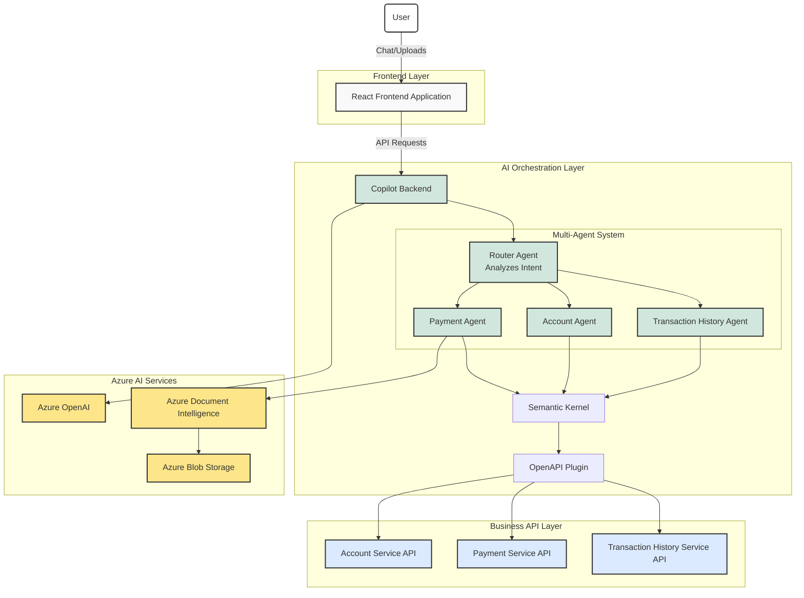

# Multi Agents Sample Application with Java and Semantic Kernel

This application is designed to explore the capabilities of generative AI within the context of multi-agent architecture. By leveraging Java and Semantic Kernel, this project aim is to build a chat application that facilitates real-time communication among multiple agents.

## Description

### Application Overview

This application is a multi-agent banking assistant powered by Java and Semantic Kernel, demonstrating how generative AI can transform traditional banking interactions into natural language conversations. The system allows users to:

- Inquire about account balances and details
- Review transaction history and search for specific transactions
- Process payments and pay bills, including through invoice image uploads
- Verify payment methods and account funds before transactions

The application employs a vertical multi-agent architecture where specialized AI agents handle different domains of the banking experience:

1. **Router Agent** - The central coordinator that analyzes user intent from chat messages and routes conversations to the appropriate specialist agent
2. **Account Agent** - Provides information about bank accounts, balances, and payment methods
3. **Transaction History Agent** - Retrieves and presents transaction history with filtering capabilities
4. **Payment Agent** - Processes bill payments, including image-based invoice scanning using Azure Document Intelligence

Each agent is equipped with specific tools to interact with banking microservices through OpenAPI definitions, providing a seamless experience where users can accomplish banking tasks through natural conversation rather than navigating traditional web interfaces.

### Project Structure

The application follows a microservices architecture organized as follows:

```
app/
├── compose.yaml                # Docker Compose configuration for local deployment
├── start-compose.ps1           # PowerShell script to start services using Docker Compose
├── start-compose.sh            # Bash script to start services using Docker Compose
├── business-api/               # Backend business microservices
│   ├── account/                # Account management service
│   │   ├── Dockerfile          # Container definition for account service
│   │   ├── pom.xml             # Maven build configuration
│   │   └── src/                # Source code for account service
│   ├── payment/                # Payment processing service
│   │   ├── Dockerfile          # Container definition for payment service
│   │   ├── pom.xml             # Maven build configuration
│   │   └── src/                # Source code for payment service
│   └── transactions-history/   # Transaction history service
│       ├── Dockerfile          # Container definition for transaction history service
│       ├── pom.xml             # Maven build configuration
│       └── src/                # Source code for transaction history service
├── copilot/                    # Copilot service - AI orchestration layer
│   ├── Dockerfile              # Container definition for copilot service
│   ├── pom.xml                 # Maven parent build configuration
│   ├── copilot-backend/        # Main copilot service implementation
│   │   ├── pom.xml             # Maven build configuration
│   │   ├── manifests/          # Kubernetes manifests for deployment
│   │   └── src/                # Source code for copilot backend
│   └── semantickernel-openapi-plugin/ # Semantic Kernel OpenAPI plugin
│       ├── pom.xml             # Maven build configuration
│       └── src/                # Plugin source code
└── frontend/                   # User interface application
    ├── Dockerfile              # Container definition for production
    ├── Dockerfile-aks          # Container definition for AKS deployment
    ├── package.json            # NPM dependencies and scripts
    ├── tsconfig.json           # TypeScript configuration
    ├── vite.config.ts          # Vite build configuration
    ├── manifests/              # Kubernetes manifests for deployment
    ├── nginx/                  # NGINX configuration for serving frontend
    ├── public/                 # Static assets
    └── src/                    # React application source code
        ├── api/                # API client code
        ├── components/         # Reusable UI components
        ├── pages/              # Application pages
        └── assets/             # Frontend assets (images, styles)
```

The project consists of three main components:
1. **Business API Services** - A set of Java microservices that handle various business domains:
   - Account Service - Manages user account information
   - Payment Service - Processes payment transactions
   - Transaction History Service - Stores and retrieves transaction records

2. **Copilot Service** - The AI orchestration layer built with Java and Semantic Kernel:
   - Copilot Backend - Core backend service that integrates with Azure OpenAI
   - Semantic Kernel OpenAPI Plugin - Extends functionality through OpenAPI integration

3. **Frontend Application** - A React-based web interface built with:
   - React/TypeScript
   - Modern frontend tooling (Vite)
   - Containerized for deployment

### Architecture

#### Flowchart


<details>
<summary>Mermaid Diagram</summary>


</details>

The architecture follows a vertical multi-agent design pattern where:

1. Users interact with the React frontend interface for natural language conversations and document uploads.
2. The Copilot Backend serves as the AI orchestration layer that hosts the multi-agent system.
3. A Router Agent analyzes user intent and delegates tasks to specialized domain agents:
   - Account Agent for handling account information requests
   - Transaction History Agent for retrieving transaction records
   - Payment Agent for processing payments and scanning invoices
4. Each agent uses Semantic Kernel to reason and execute operations via tools.
5. The OpenAPI Plugin maps natural language intents to structured API calls.
6. Business API services handle the actual banking operations.
7. Azure services provide the AI capabilities (Azure OpenAI) and document processing (Azure Document Intelligence).

This architecture enables a conversational interface to traditional banking services by leveraging AI to understand user intent and orchestrate appropriate actions across multiple specialized microservices.

#### Interaction Flow


- [Mermaid Notation](README-Backend-Diagram.md)

This sequence diagram illustrates the flow of interactions in the application:

1. **Initial Request Processing**: The user interacts with the frontend, which forwards the request to the Copilot Backend.

2. **Intent Determination**: The Router Agent uses Azure OpenAI to analyze the user's intent and routes the request to the appropriate specialist agent.

3. **Agent-Specific Processing**:
   - For account information, the Account Agent communicates with both Azure OpenAI and the Account API to gather and present information.
   - For transaction history, the Transaction Agent retrieves and formats transaction data.
   - For payments, the Payment Agent might process document uploads, validate payment details, and execute transactions.

4. **Response Flow**: The response flows back through the system to the user with appropriate formatting and presentation.

Each agent follows a similar pattern of using Azure OpenAI to generate completions with tools, calling the appropriate business APIs, and formatting responses for the user, creating a consistent and natural conversational experience.

### Class Diagram


- [Mermaid Notation](README-Backend-Diagram.md)

The class diagram shows the key classes of the multi-agent banking application, including:

1. **Core Application Classes**:
   - `CopilotApplication`: The main Spring Boot application entry point
   - `ChatController`: Handles API requests from the frontend and coordinates with agents

2. **Agent System**:
   - `RouterAgent`: The central coordinator that analyzes intent and delegates to specialized agents
   - `PaymentAgent`: Processes payment requests and invoice scanning
   - `AccountAgent`: Handles account information requests
   - `TransactionsReportingAgent`: Manages transaction history queries
   - `IntentExtractor`: Uses Azure OpenAI to determine user intent from messages

3. **Domain Models**:
   - `Transaction`: Represents payment transactions with details
   - `Account`: Contains account information and payment methods
   - `Payment`: Represents a payment request
   - `PaymentMethodSummary`: Holds details about available payment methods

4. **Services**:
   - `TransactionService`: Manages transaction data storage and retrieval
   - `LoggedUserService`: Handles user authentication and context

5. **Semantic Kernel Integration**:
   - `SemanticKernelOpenAPIImporter`: Connects the AI agents to business APIs via OpenAPI definitions

Each agent follows a similar pattern of using Semantic Kernel to process natural language interactions, determine intent, and execute appropriate business logic through the OpenAPI plugin.

### Frontend Architecture

The frontend is a modern React application built with TypeScript that provides the user interface for interacting with the multi-agent banking system. It follows a component-based architecture with clear separation of concerns.

#### Component Diagram


- [Mermaid Notation](README-Frontend-Diagram.md)

#### Key Features and Components

1. **Routing and Layout**
   - Uses React Router for navigation
   - Main layout with header, navigation, and content areas
   - Chat page as the primary interface

2. **Component Hierarchy**
   - **QuestionInput**: Allows users to enter queries and upload attachments
   - **AnswerDisplay**: Shows AI-generated responses with formatting and citations
   - **UserChatMessage**: Displays user messages and attachments
   - **AnalysisPanel**: Shows thought processes and supporting content
   - **Examples**: Provides example queries for users to try

3. **API Communication**
   - RESTful API client for backend communication
   - Support for streaming responses for real-time AI generation
   - File upload functionality for document processing
   - Authentication token handling

4. **Authentication**
   - Azure AD integration via MSAL (Microsoft Authentication Library)
   - Token acquisition and management
   - Conditional rendering based on authentication status

5. **State Management**
   - React hooks for local state management
   - Configuration settings for AI behavior
   - Chat history and streaming state management

This frontend architecture provides a responsive and interactive user interface that enables natural conversation with the multi-agent banking system, seamlessly handling different types of queries, file uploads, and displaying AI-generated responses with supporting evidence.

## Demo

## Features

- feature:1
- feature:2

## Requirement

## Usage

## Installation

## References

- [Azure Samples - Agent OpenAI Java Banking Assistant](https://github.com/Azure-Samples/agent-openai-java-banking-assistant)

## Licence

Released under the [MIT license](https://gist.githubusercontent.com/shinyay/56e54ee4c0e22db8211e05e70a63247e/raw/f3ac65a05ed8c8ea70b653875ccac0c6dbc10ba1/LICENSE)

## Author

- github: <https://github.com/shinyay>
- twitter: <https://twitter.com/yanashin18618>
- mastodon: <https://mastodon.social/@yanashin>
